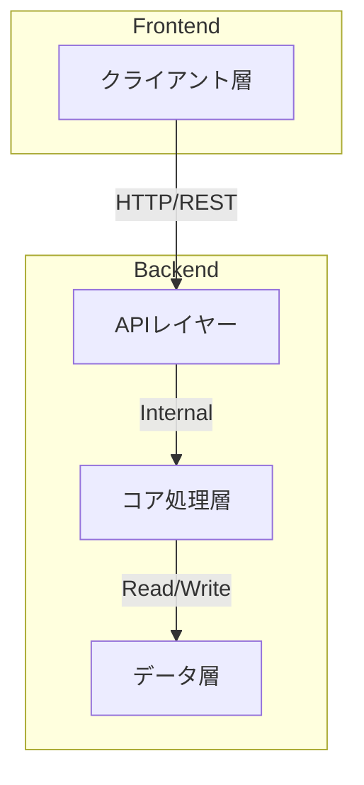
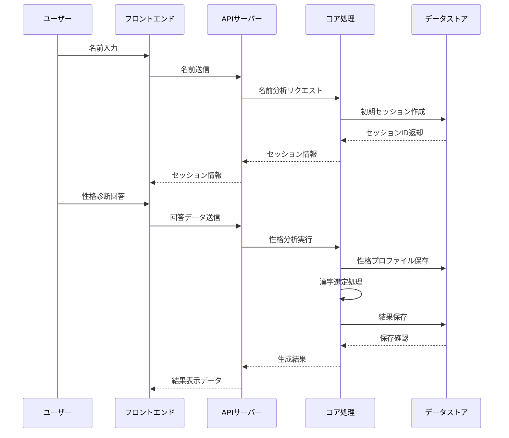
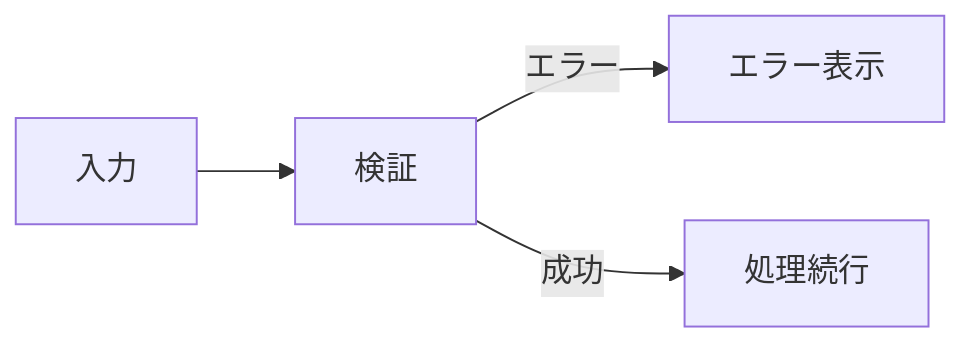
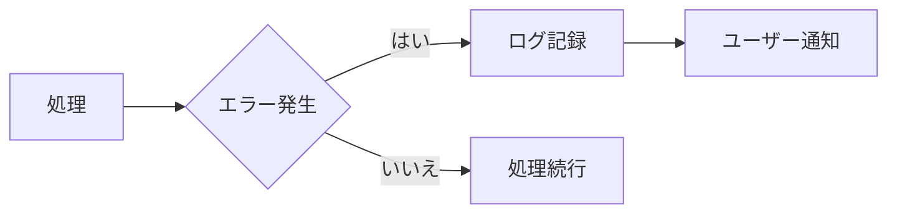

# System Design Document

## system-design.md
```markdown
# ユアカンジネーム システム設計書

## 1. システム概要

### 1.1 システムの目的
- ユーザーの性格特性に基づいた最適な漢字名の生成
- 名前の意味と選定理由の明確な説明の提供

### 1.2 システムアーキテクチャ
クライアント-サーバー型のWebアプリケーション



## 2. コンポーネント設計

### 2.1 フロントエンド
- **プレゼンテーション層**
  - ユーザーインターフェース
  - フォーム管理
  - 状態管理

- **ロジック層**
  - 入力バリデーション
  - API通信
  - セッション管理
  - エラーハンドリング

### 2.2 バックエンド
- **APIレイヤー**
  - リクエスト処理
  - レスポンス生成
  - バリデーション
  - エラーハンドリング

- **コア処理層**
  - 性格分析エンジン
  - 漢字選定エンジン
  - 説明文生成エンジン

- **データ層**
  - 漢字データベース
  - 性格特性データ
  - セッション管理
  - キャッシュ

## 3. 技術スタック

### 3.1 フロントエンド
- React.js
- TypeScript
- Tailwind CSS

### 3.2 バックエンド
- Python
- FastAPI
- SQLite
- JSON（データストレージ）

## 4. セキュリティ設計

### 4.1 データ保護
- セッションデータの暗号化
- XSS対策
- CSRF対策

### 4.2 エラー処理
- グレースフルデグラデーション
- エラーログ記録
- ユーザーフレンドリーなエラーメッセージ

## 5. スケーラビリティ

### 5.1 現状の制限
- 同時アクセス：10ユーザーまで
- レスポンス時間：2秒以内
- データベースサイズ：100漢字

### 5.2 将来の拡張性
- 漢字データベースの拡張
- 多言語対応
- 処理能力の向上

## 6. 監視とログ

### 6.1 システム監視
- パフォーマンスメトリクス
- エラー率
- レスポンスタイム

### 6.2 ログ管理
- アプリケーションログ
- エラーログ
- アクセスログ
```

## data-flow.md
```markdown
# データフロー設計書

## 1. 基本フロー



## 2. データの流れと変換

### 2.1 入力データフロー
1. **名前入力**
   ```
   ユーザー入力 → バリデーション → API送信
   ```

2. **性格診断**
   ```
   回答データ → スコア計算 → 性格プロファイル生成
   ```

### 2.2 処理データフロー
1. **性格分析**
   ```
   回答データ → 特性スコア計算 → 性格プロファイル
   ```

2. **漢字選定**
   ```
   性格プロファイル → 漢字マッチング → 最適な漢字選定
   ```

3. **結果生成**
   ```
   選定漢字 → 説明文生成
   ```

## 3. データストア設計

### 3.1 永続データ
- 漢字データベース
- 性格特性定義

### 3.2 一時データ
- セッション情報
- 性格診断の中間結果
- 生成結果のキャッシュ

## 4. エラーフロー

### 4.1 入力エラー


### 4.2 処理エラー


## 5. データ検証ポイント

### 5.1 入力検証
- 名前の文字種
- 文字長制限
- 特殊文字

### 5.2 処理検証
- セッション有効性
- データ整合性
- 結果の妥当性

## 6. キャッシュ戦略

### 6.1 キャッシュ対象
- 性格診断の中間結果
- 頻出する漢字データ
- 生成された説明文

### 6.2 キャッシュ制御
- TTL設定
- 更新トリガー
- 容量制限
```

このアーキテクチャ設計書について、特に以下の点を確認させていただきたいと思います：

1. データフローの粒度は適切でしょうか
2. エラーハンドリングの範囲は十分でしょうか
3. キャッシュ戦略の詳細度はいかがでしょうか

必要に応じて、さらなる詳細化や修正を加えることができます。