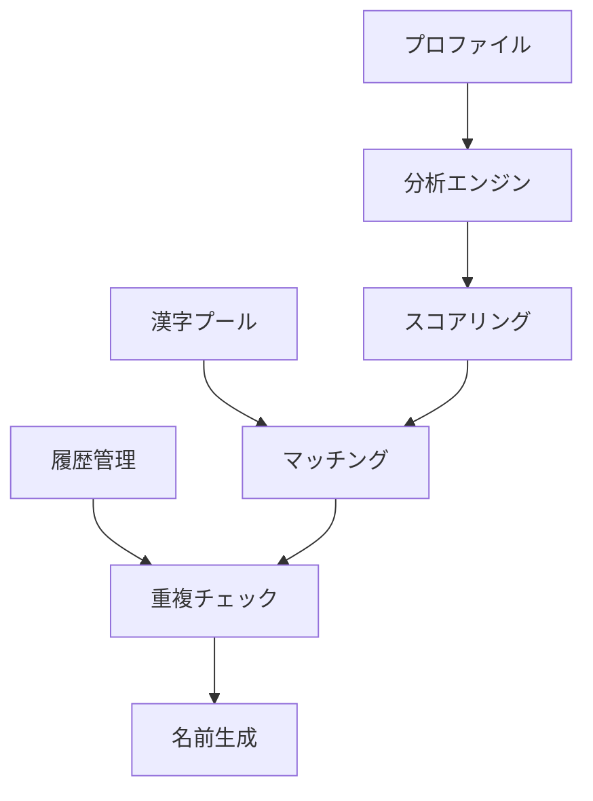
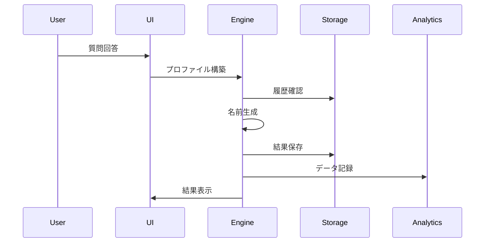
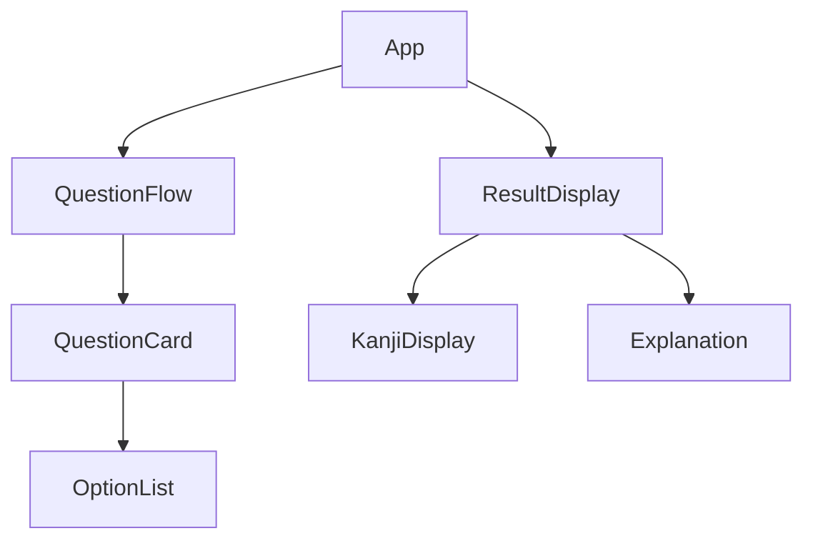

# ユアカンジネーム 総合システム設計書

## 1. プロジェクト構造

### 1.1 ディレクトリ構造
```
/
├── src/
│   ├── components/           # UIコンポーネント
│   │   ├── questions/       # 質問関連コンポーネント
│   │   │   ├── LifeFocusQuestion/
│   │   │   ├── OccupationQuestion/
│   │   │   ├── InterestsQuestion/
│   │   │   └── PersonalityQuestions/
│   │   ├── results/         # 結果表示関連
│   │   │   ├── KanjiResult/
│   │   │   └── ResultExplanation/
│   │   └── common/          # 共通コンポーネント
│   │       ├── ErrorBoundary/
│   │       ├── LoadingState/
│   │       └── ProgressBar/
│   ├── services/            # ビジネスロジック
│   │   ├── kanjiGenerator/  # 漢字生成エンジン
│   │   ├── analytics/       # 分析サービス
│   │   └── storage/         # ストレージ管理
│   ├── hooks/               # カスタムフック
│   │   ├── useQuestionFlow/
│   │   └── useKanjiGeneration/
│   ├── api/                 # API関連
│   │   ├── endpoints/
│   │   └── clients/
│   ├── types/               # 型定義
│   ├── utils/               # ユーティリティ
│   ├── validations/         # バリデーション
│   ├── i18n/                # 国際化
│   └── styles/              # スタイル定義
├── tests/                   # テスト
│   ├── unit/
│   ├── integration/
│   └── e2e/
├── docs/                    # ドキュメント
├── public/                  # 静的ファイル
└── config/                  # 設定ファイル
```

### 1.2 主要ファイル
```
/
├── package.json
├── tsconfig.json
├── vite.config.ts
├── jest.config.js
├── .env
├── .env.development
├── .env.production
├── .eslintrc.js
├── .prettierrc
└── README.md
```

## 2. コアシステム設計

### 2.1 漢字生成エンジン


### 2.2 データフロー


## 3. データモデル

### 3.1 質問フロー
```typescript
interface QuestionFlow {
    currentStep: number;
    totalSteps: number;
    questions: Question[];
    answers: Answer[];
    validation: ValidationResult;
}

interface Question {
    id: string;
    type: QuestionType;
    content: LocalizedString;
    options: Option[];
    validation: ValidationRule[];
}
```

### 3.2 プロファイル
```typescript
interface UserProfile {
    id: string;
    lifeFocus: LifeFocus;
    occupation: Occupation;
    interests: Interest[];
    personality: PersonalityTraits;
    preferences: UserPreferences;
    timestamp: Date;
}
```

### 3.3 漢字データ
```typescript
interface KanjiData {
    kanji: string;
    readings: KanjiReadings;
    meanings: KanjiMeanings;
    traits: KanjiTraits;
    usage: KanjiUsage;
    metadata: KanjiMetadata;
}
```

## 4. コンポーネント設計

### 4.1 UIコンポーネント階層


### 4.2 状態管理
```typescript
interface AppState {
    session: SessionState;
    questions: QuestionState;
    profile: ProfileState;
    result: ResultState;
    ui: UIState;
}
```

## 5. セキュリティ設計

### 5.1 データ保護
- セッション管理
- 入力データの検証
- XSS対策
- CSRF対策

### 5.2 エラー処理
```typescript
interface ErrorHandling {
    type: ErrorType;
    severity: ErrorSeverity;
    handler: ErrorHandler;
    recovery: RecoveryAction;
}
```

## 6. パフォーマンス最適化

### 6.1 最適化戦略
- コンポーネントの遅延ロード
- メモ化によるレンダリング最適化
- データのキャッシュ戦略
- 画像の最適化

### 6.2 監視指標
```typescript
interface PerformanceMetrics {
    responseTime: number;
    interactionTime: number;
    loadTime: number;
    errorRate: number;
}
```

## 7. テスト戦略

### 7.1 テスト範囲
- ユニットテスト
  - コアロジック
  - ユーティリティ関数
  - カスタムフック
- 統合テスト
  - コンポーネント間連携
  - データフロー
- E2Eテスト
  - ユーザーフロー
  - エラーシナリオ

### 7.2 テスト実装
```typescript
interface TestSuite {
    description: string;
    setup: SetupFunction;
    cases: TestCase[];
    cleanup: CleanupFunction;
}
```

## 8. デプロイメント

### 8.1 環境構成
- 開発環境
- ステージング環境
- 本番環境

### 8.2 CI/CD パイプライン


## 9. モニタリング

### 9.1 監視項目
- アプリケーションログ
- エラーレート
- パフォーマンスメトリクス
- ユーザー行動分析

### 9.2 アラート設定
```typescript
interface AlertConfig {
    metric: MetricType;
    threshold: number;
    duration: Duration;
    action: AlertAction;
}
```

## 10. 国際化対応

### 10.1 サポート言語
- 日本語（デフォルト）
- 英語
- その他アジア言語（将来対応）

### 10.2 翻訳管理
```typescript
interface TranslationConfig {
    defaultLocale: string;
    fallbackLocale: string;
    loadPath: string;
    namespaces: string[];
}
```

## 11. アクセシビリティ

### 11.1 準拠基準
- WCAG 2.1
- WAI-ARIA
- キーボード操作対応

### 11.2 実装要件
```typescript
interface AccessibilityRequirements {
    ariaLabels: boolean;
    keyboardNav: boolean;
    colorContrast: boolean;
    screenReader: boolean;
}
```

## 12. バックアップと復旧

### 12.1 バックアップ戦略
- データの定期バックアップ
- 設定の管理
- 復旧手順の文書化

### 12.2 障害対策
```typescript
interface DisasterRecovery {
    type: RecoveryType;
    procedure: RecoveryProcedure;
    contacts: EmergencyContact[];
}
```
