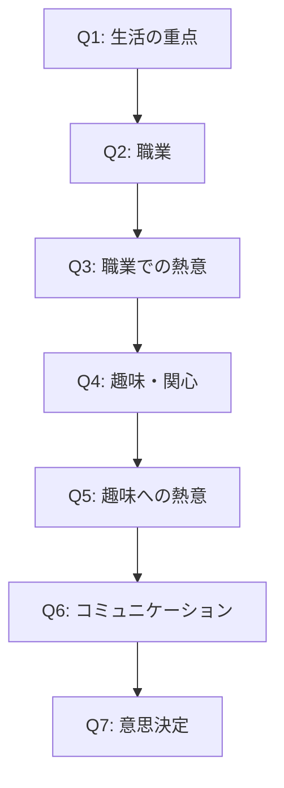

# 質問フロー設計

## 1. 質問の流れ

## 2. 質問詳細

### Q1: 生活の重点
「あなたの生活で、より重きを置いているのはどちらですか？」
- 仕事や社会での活動
- プライベートや趣味の時間

### Q2: 職業
「現在の職業に最も近いものをお選びください」
- 技術職（開発・設計・研究など）
- 営業職（法人・個人）
- クリエイティブ職（デザイン・企画など）
- 医療・福祉職
- 教育関係
- サービス業
- 主婦・主夫
- 学生
- その他（自由入力）

### Q3: 職業での熱意
「仕事や活動に対する姿勢を教えてください」
- とても情熱的に取り組んでいる
- 普通に取り組んでいる
- あまり熱心ではない

### Q4: 趣味・関心
「普段の趣味や関心事をお選びください（3つまで）」
- 自然・アウトドア（ハイキング、キャンプなど）
- 芸術・創作（絵画、音楽、写真など）
- スポーツ・運動
- 文化・学習（読書、語学など）
- 社交・コミュニティ活動
- 技術・ものづくり
- 料理・食
- 旅行・探索
- その他（自由入力）

### Q5: 趣味への熱意
「趣味や関心事への取り組み方を教えてください」
- 非常に熱心に取り組んでいる
- 時間があるときに楽しんでいる
- たまに気分転換程度

### Q6: コミュニケーション
「人との関わり方について、最も当てはまるものを選んでください」
- 積極的に関わることが好き
- 状況に応じて対応している
- 必要最小限に留めたい

### Q7: 意思決定
「物事を決めるとき、どのように判断することが多いですか？」
- 直感的に決める
- 慎重に検討して決める
- 周りの意見を参考に決める

## 3. バリデーションルール

1. すべての質問は必須回答
2. Q4の趣味選択は1-3個まで
3. その他選択は2個まで
4. 自由入力は30文字まで

## 4. 分岐ロジック

1. Q2で「その他」を選択
   - 自由入力欄を表示
   - 入力内容に基づいて最も近い職種カテゴリにマッピング

2. Q4で「その他」を選択
   - 自由入力欄を表示
   - 3つまでの制限を維持

## 5. スコアリング影響

各回答は以下の要素に影響：
1. 第一文字選定（職業/趣味の重みづけ）
2. 第二文字選定（性格特性の判定）
3. 漢字の組み合わせ順序
